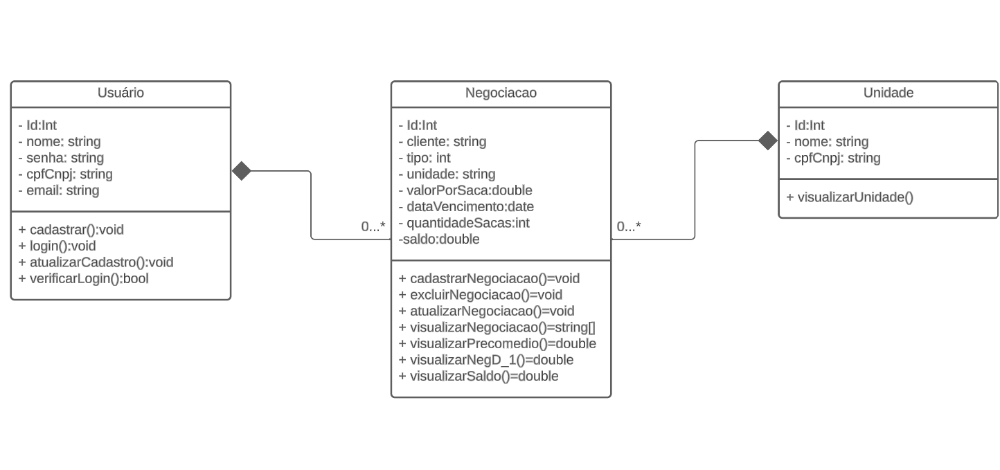
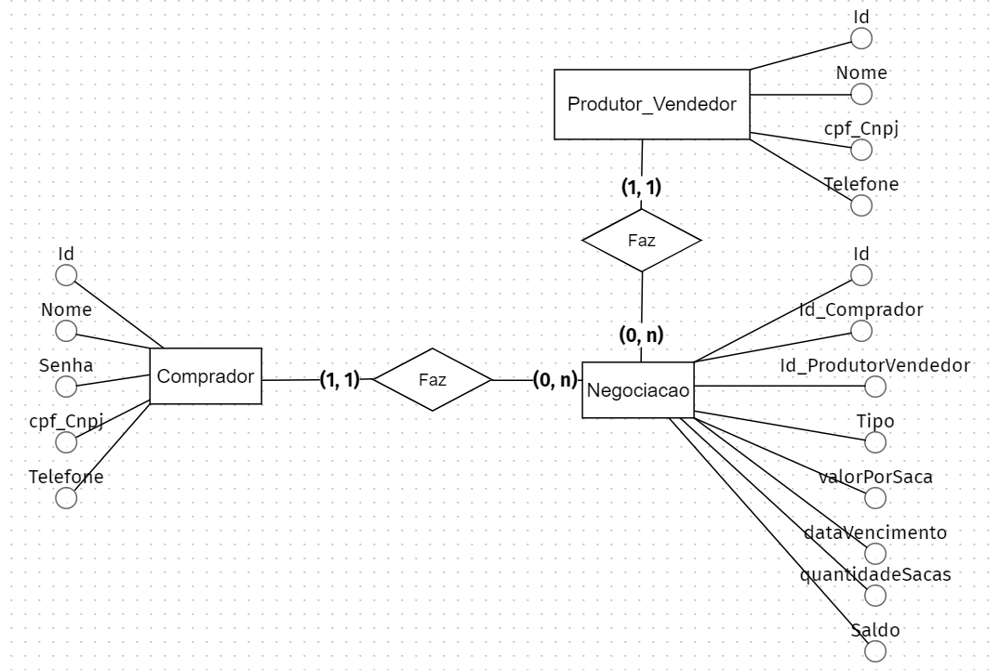

# Especificações do Projeto

Pré-requisitos: <a href="1-Documentação de Contexto.md"> Documentação de Contexto</a>

Definição do problema e ideia de solução a partir da perspectiva do usuário. É composta pela definição do  diagrama de personas, histórias de usuários, requisitos funcionais e não funcionais além das restrições do projeto.

Apresente uma visão geral do que será abordado nesta parte do documento, enumerando as técnicas e/ou ferramentas utilizadas para realizar a especificações do projeto

## Arquitetura e Tecnologias

A arquitetura do projeto é dividida em duas partes principais: o front-end e o back-end. 

O **front-end** é construído usando **React Native** com **React Native Paper**. React Native é uma estrutura que permite o desenvolvimento de aplicativos móveis nativos para iOS e Android usando JavaScript e React. React Native Paper é uma biblioteca de componentes de design de material para React Native que segue as melhores práticas de acessibilidade da Web.

O **back-end** é construído usando **Node.js** e o Sistema de Gerenciamento de Banco de Dados (SGBD) **MySQL**. 

A comunicação é feita através da **API REST**

## Project Model Canvas

## Requisitos

As tabelas que se seguem apresentam os requisitos funcionais e não funcionais que detalham o escopo do projeto. Para determinar a prioridade de requisitos, aplicar uma técnica de priorização de requisitos e detalhar como a técnica foi aplicada.

### Requisitos Funcionais

| ID     | Descrição do Requisito                                       | Prioridade |
|-------|--------------------------------------------------------------|------------|
| RF-001| Oferecer uma tela de login para autenticação dos usuários. | ALTA |  
| RF-002| Possibilitar a seleção da unidade da empresa ao criar uma negociação.| MÉDIA |
| RF-003| Registrar negociações | ALTA | 
| RF-004| Visualizar todas as negociações| ALTA | 
| RF-005| Excluir negociações | ALTA | 
| RF-006| Visualizar média de preço da saca de venda e compra | MÉDIA |
| RF-007| Visualizar consolidado do dia anterior (D-1) | MÉDIA |
| RF-008| Visualizar o saldo | MÉDIA | 
| RF-009| Mostrar quando o saldo for negativo | MÉDIA |
| RF-010| Filtrar por unidade, data de lançamento, data de vencimento, tipo de operação, cliente/produtor | ALTA |
| RF-011| Editar negociação | ALTA |
| RF-012| Possibilitar a seleção do nome do cliente/produtor ao criar uma negociação. | ALTA |
| RF-013| Visualizar o total em sacas de compra e venda por unidade | ALTA |
| RF-014| Permitir o registro de usuários. | ALTA |
| RF-015| Permitir ao usúario visualizar separadamente as negociações registradas por ele. | ALTA |
| RF-016| Mostrar o valor total da negociação. | ALTA |
| RF-017| Mostrar a usuário responsável pela criação de cada negociação. | ALTA |

### Requisitos não Funcionais

| ID     | Descrição do Requisito                                       | Prioridade |
|-------|--------------------------------------------------------------|------------|
| RNF-001| O sistema deve ser responsivo para rodar em um dispositivo móvel. | MÉDIA |
| RNF-002| Utilizar o MySQL como SGBD para armazenar informações de negociações e usuários. | ALTA |
| RNF-003| Criar uma interface de usuário intuitiva e de fácil uso, considerando a simplicidade e usabilidade para os usuários. | ALTA |
| RNF-004| Utilizar armazenamento em nuvem | MÉDIA |
| RNF-005| Autenticar usuários para evitar acessos não autorizados | ALTA |

## Restrições

O projeto está restrito pelos itens apresentados na tabela a seguir.

|ID| Restrição                                             |
|--|-------------------------------------------------------|
|01| Deve ser capaz de suportar até 10 usuarios            |
|02| Utilizar Javascript como linguagem predominante       |
|03| O projeto deverá ser entregue até o final do semestre |

## Diagrama de Casos de Uso

## Diagrama de Classes

Na engenharia de software, um diagrama de classes é um tipo de diagrama de estrutura estática que descreve a estrutura de um sistema mostrando as classes do sistema, seus atributos, operações e os relacionamentos entre os objetos.

No diagrama, as classes são representadas com caixas que contêm três compartimentos: O compartimento superior contém o nome da classe. É impresso em negrito e centralizado, e a primeira letra é maiúscula. O compartimento do meio contém os atributos da classe. Eles são alinhados à esquerda e a primeira letra é minúscula. O compartimento inferior contém as operações que a classe pode executar. Eles também são alinhados à esquerda e a primeira letra é minúscula. Uma classe com três compartimentos.No projeto de um sistema, várias classes são identificadas e agrupadas em um diagrama de classes que ajuda a determinar as relações estáticas entre elas. Na modelagem detalhada, as classes do projeto conceitual são frequentemente divididas em subclasses.

## Projeto da Base de Dados

O projeto da base de dados corresponde à representação das entidades e relacionamentos identificadas no Modelo ER, no formato de tabelas, com colunas e chaves primárias/estrangeiras necessárias para representar corretamente as restrições de integridade.

## Modelo ER

O Modelo ER representa através de um diagrama como as entidades (coisas, objetos) se relacionam entre si na aplicação interativa.]

Na figura abaixo é mostrado o Modelo Relacional(MR) desenvolvido na plataforma "AgroTradeMonitor" para o projeto.

## Esquema Relacional

O Esquema Relacional corresponde à representação dos dados em tabelas juntamente com as restrições de integridade e chave primária.

Na figura abaixo é mostrado o Esquema Relacional(ER) desenvolvido no próprio banco de dados para o projeto.

