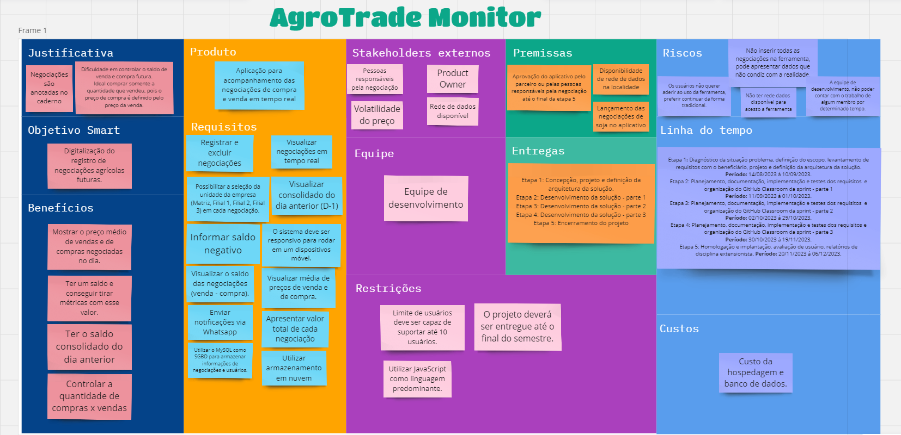
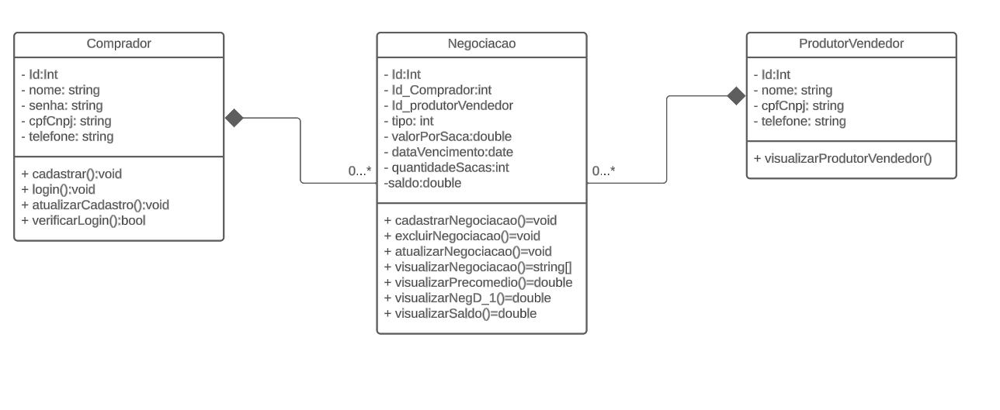
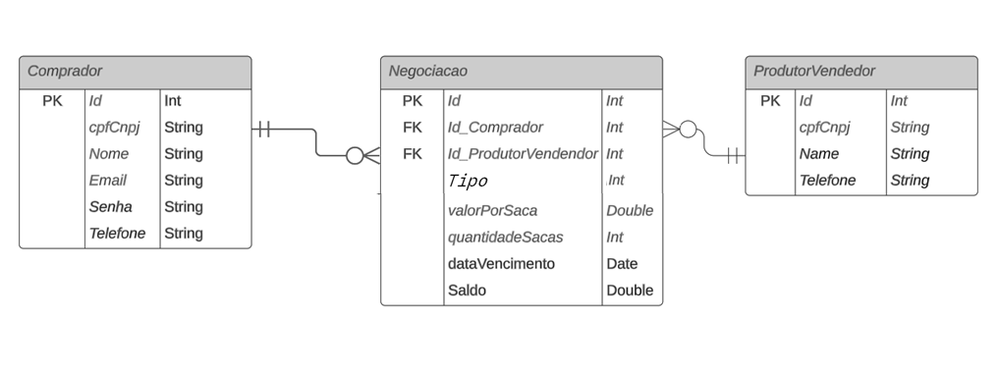

# Especificações do Projeto

Pré-requisitos: <a href="1-Documentação de Contexto.md"> Documentação de Contexto</a>

Definição do problema e ideia de solução a partir da perspectiva do usuário. É composta pela definição do  diagrama de personas, histórias de usuários, requisitos funcionais e não funcionais além das restrições do projeto.

Apresente uma visão geral do que será abordado nesta parte do documento, enumerando as técnicas e/ou ferramentas utilizadas para realizar a especificações do projeto

## Arquitetura e Tecnologias

o	Descreva brevemente a arquitetura definida para o projeto e as tecnologias a serem utilizadas. Sugere-se a criação de um diagrama de componentes da solução.

## Project Model Canvas

## Requisitos

As tabelas que se seguem apresentam os requisitos funcionais e não funcionais que detalham o escopo do projeto. Para determinar a prioridade de requisitos, aplicar uma técnica de priorização de requisitos e detalhar como a técnica foi aplicada.

### Requisitos Funcionais

| ID     | Descrição do Requisito                                       | Prioridade |
|-------|--------------------------------------------------------------|------------|
| RF-001| Oferecer uma tela de login para autenticação dos usuários. | ALTA |  
| RF-002| Possibilitar a seleção da unidade da empresa (Matriz, Filial 1, Filial 2, Filial 3) em cada negociação. | MÉDIA |
| RF-003| Preencher os campos essenciais pré-definidos (produto, operação, valor por saca, quantidade de sacas, data de vencimento). | ALTA |
| RF-004| Registrar negociações | ALTA | 
| RF-005| Visualizar negociações| ALTA | 
| RF-006| Excluir negociações | ALTA | 
| RF-007| Visualizar média de preços de venda e de compra | MÉDIA |
| RF-008| Visualizar consolidado do dia anterior (D-1) | MÉDIA |
| RF-009| Visualizar o saldo | MÉDIA | 
| RF-010| Informar saldo negativo | MÉDIA |
| RF-011| Enviar notificações via Whatsapp | BAIXA |
| RF-012| Apresentar valor total de cada negociação | ALTA |

### Requisitos não Funcionais

| ID     | Descrição do Requisito                                       | Prioridade |
|-------|--------------------------------------------------------------|------------|
| RNF-001| O sistema deve ser responsivo para rodar em um dispositivos móvel. | MÉDIA |
| RNF-002| Utilizar o MySQL como SGBD para armazenar informações de negociações e usuários. | ALTA |
| RNF-003| Criar uma interface de usuário intuitiva e de fácil uso, considerando a simplicidade e usabilidade para os usuários. | ALTA |
| RNF-004| Garantir que a aplicação seja acessível a todos os tipos de usuários, incluindo suporte a leitores de tela e alto contraste. | BAIXA |
| RNF-005| Considerar que o usuário poderá acessar a aplicação de uma área remota | BAIXA |
| RNF-006| Utilizar armazenamento em nuvem | MÉDIA |

## Restrições

O projeto está restrito pelos itens apresentados na tabela a seguir.

|ID| Restrição                                             |
|--|-------------------------------------------------------|
|01| Deve ser capaz de suportar até 10 usuarios            |
|02| Utilizar Javascript como linguagem predominante       |
|03| O projeto deverá ser entregue até o final do semestre |

## Diagrama de Casos de Uso

O diagrama de casos de uso é o próximo passo após a elicitação de requisitos, que utiliza um modelo gráfico e uma tabela com as descrições sucintas dos casos de uso e dos atores. Ele contempla a fronteira do sistema e o detalhamento dos requisitos funcionais com a indicação dos atores, casos de uso e seus relacionamentos. 

As referências abaixo irão auxiliá-lo na geração do artefato “Diagrama de Casos de Uso”.

> **Links Úteis**:
> - [Criando Casos de Uso](https://www.ibm.com/docs/pt-br/elm/6.0?topic=requirements-creating-use-cases)
> - [Como Criar Diagrama de Caso de Uso: Tutorial Passo a Passo](https://gitmind.com/pt/fazer-diagrama-de-caso-uso.html/)
> - [Lucidchart](https://www.lucidchart.com/)
> - [Astah](https://astah.net/)
> - [Diagrams](https://app.diagrams.net/)

## Diagrama de Classes

Na engenharia de software, um diagrama de classes é um tipo de diagrama de estrutura estática que descreve a estrutura de um sistema mostrando as classes do sistema, seus atributos, operações e os relacionamentos entre os objetos.

No diagrama, as classes são representadas com caixas que contêm três compartimentos: O compartimento superior contém o nome da classe. É impresso em negrito e centralizado, e a primeira letra é maiúscula. O compartimento do meio contém os atributos da classe. Eles são alinhados à esquerda e a primeira letra é minúscula. O compartimento inferior contém as operações que a classe pode executar. Eles também são alinhados à esquerda e a primeira letra é minúscula. Uma classe com três compartimentos.No projeto de um sistema, várias classes são identificadas e agrupadas em um diagrama de classes que ajuda a determinar as relações estáticas entre elas. Na modelagem detalhada, as classes do projeto conceitual são frequentemente divididas em subclasses.

## Modelo ER

O Modelo ER representa através de um diagrama como as entidades (coisas, objetos) se relacionam entre si na aplicação interativa.]

Na figura abaixo é mostrado o Modelo Relacional(MR) desenvolvido na plataforma "AgroTradeMonitor" para o projeto.

## Esquema Relacional

O Esquema Relacional corresponde à representação dos dados em tabelas juntamente com as restrições de integridade e chave primária.

Na figura abaixo é mostrado o Esquema Relacional(ER) desenvolvido no próprio banco de dados para o projeto.

## Projeto da Base de Dados

O projeto da base de dados corresponde à representação das entidades e relacionamentos identificadas no Modelo ER, no formato de tabelas, com colunas e chaves primárias/estrangeiras necessárias para representar corretamente as restrições de integridade.
